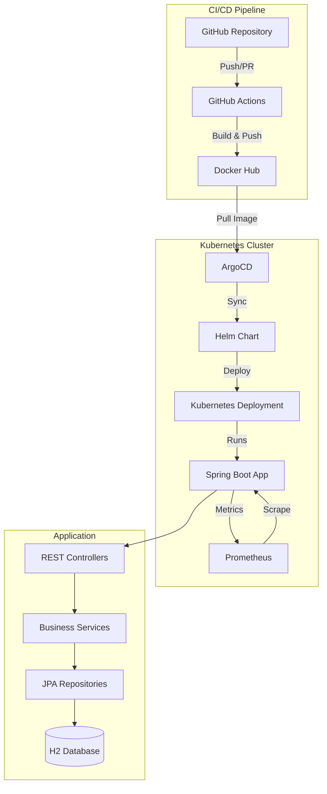
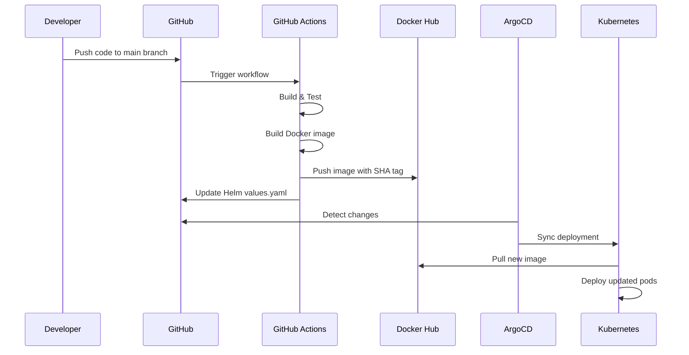

# DevOps Assignment - Agricultural Marketplace Platform

A comprehensive Spring Boot-based agricultural marketplace platform with full DevOps infrastructure including CI/CD pipelines, containerization, Kubernetes orchestration, and GitOps deployment.

## Project Overview

This project is a full-stack agricultural marketplace application that enables farmers, suppliers, distributors, and producers to manage products, process orders, and track business analytics. The platform includes user management, product catalog, order processing, notification system, and a comprehensive dashboard with real-time statistics.

### Key Features

- **User Management**: Multi-role user system (Farmers, Suppliers, Distributors, Producers, Admin)
- **Product Catalog**: Product management with inventory tracking
- **Order Processing**: Complete order lifecycle management
- **Notification System**: Real-time notifications for order updates and price changes
- **Dashboard Analytics**: Real-time statistics and popular products tracking
- **RESTful API**: Comprehensive REST API with Swagger documentation
- **Monitoring & Metrics**: Prometheus metrics and health checks
- **GitOps Deployment**: Automated deployment with ArgoCD

### Tech Stack

- **Backend**: Java 21, Spring Boot 3.5.9
- **Database**: H2 Database (file-based)
- **Build Tool**: Maven
- **Containerization**: Docker
- **Orchestration**: Kubernetes
- **Package Manager**: Helm
- **CI/CD**: GitHub Actions
- **GitOps**: ArgoCD
- **Monitoring**: Prometheus, Micrometer
- **Documentation**: SpringDoc OpenAPI (Swagger)

## System Architecture

### Description

The application follows a microservices-ready architecture with clear separation of concerns. The backend exposes RESTful APIs that interact with the database through JPA repositories. The system is containerized using Docker and deployed to Kubernetes clusters using Helm charts. ArgoCD manages the GitOps workflow, automatically syncing deployments based on Git repository changes.



### Backend

The backend is built with Spring Boot and follows a layered architecture:

- **Controllers**: REST API endpoints with request/response handling
- **Services**: Business logic layer with transaction management
- **Repositories**: Data access layer using Spring Data JPA
- **Models**: Entity classes with JPA annotations and validation
- **Configuration**: Custom beans for metrics, exception handling, and data initialization

**Key Components:**

- **Spring Boot Actuator**: Health checks and application metrics
- **Micrometer**: Custom business metrics (user counts, order statistics, API performance)
- **Spring Data JPA**: Database operations with Hibernate
- **Bean Validation**: Input validation using Jakarta Validation
- **Global Exception Handler**: Centralized error handling
- **Jackson Configuration**: JSON serialization with LocalDateTime support

### DevOps Infrastructure

#### CI/CD Pipeline

The GitHub Actions workflow (`.github/workflows/deploy.yaml`) includes:

1. **Build Job**:
   - Java 21 setup with Maven caching
   - Dependency resolution
   - Compilation and testing
   - Docker image build (multi-stage)
   - Push to Docker Hub
   - Automated Helm chart updates

2. **Security Scanning**:
   - Trivy vulnerability scanning
   - SARIF report generation
   - GitHub Security tab integration

#### Containerization

- **Multi-stage Dockerfile**: Optimized build process
- **Non-root user**: Security best practices
- **Health checks**: Built-in container health monitoring
- **Alpine-based**: Minimal image size

#### Orchestration

- **Helm Charts**: Kubernetes package management
- **ServiceMonitor**: Prometheus service discovery
- **Resource Management**: CPU and memory limits/requests
- **Namespace Isolation**: Dedicated namespace for deployment

#### GitOps

- **ArgoCD**: Automated deployment synchronization
- **Self-healing**: Automatic drift detection and correction
- **Sync Policies**: Automated sync with pruning
- **Revision History**: Rollback capabilities

#### Monitoring & Logging

- **Prometheus**: Metrics collection and querying
- **ServiceMonitor**: Automatic metric discovery
- **Promtail**: Log aggregation (configured)
- **Custom Metrics**: Business-specific metrics (orders, users, products)

## Project Structure

```
devops-assignment/
├── .github/
│   └── workflows/
│       └── deploy.yaml              # CI/CD pipeline
├── argocd/
│   ├── application.yaml             # ArgoCD application manifest
│   └── application-prometheus.yaml  # Prometheus ArgoCD config
├── helm/
│   └── devops-assignment/
│       ├── Chart.yaml               # Helm chart metadata
│       ├── values.yaml              # Helm configuration values
│       └── templates/
│           ├── deployment.yaml      # Kubernetes deployment
│           ├── service.yaml         # Kubernetes service
│           ├── configmap.yaml       # Configuration map
│           └── servicemonitor.yaml  # Prometheus ServiceMonitor
├── src/
│   ├── main/
│   │   ├── java/
│   │   │   └── uz/javachi/devops_assignment/
│   │   │       ├── controller/      # REST API controllers
│   │   │       ├── service/         # Business logic layer
│   │   │       ├── model/           # Entity models
│   │   │       ├── repository/      # JPA repositories
│   │   │       ├── config/          # Configuration classes
│   │   │       └── DevopsAssignmentApplication.java
│   │   └── resources/
│   │       └── application.yaml     # Application configuration
│   └── test/                        # Test files
├── data/
│   └── app-db.mv.db                 # H2 database file
├── Dockerfile                        # Container image definition
├── pom.xml                          # Maven dependencies
├── DEPLOYMENT.md                     # Deployment guide
├── promql-queries.md                # Prometheus query examples
└── README.md                         # This file
```

## Deployment Workflow

The deployment process follows a GitOps approach with automated CI/CD:

### 1. Code Push to GitHub



### 2. CI/CD Pipeline Steps

1. **Trigger**: Push to `main` branch or manual workflow dispatch
2. **Build**: Compile Java code, run tests
3. **Docker Build**: Multi-stage build creates optimized image
4. **Security Scan**: Trivy scans for vulnerabilities
5. **Push to Registry**: Image pushed to Docker Hub with SHA and `latest` tags
6. **Helm Update**: Automatically updates image tag in `values.yaml`
7. **ArgoCD Sync**: ArgoCD detects changes and syncs to cluster

### 3. Environment Promotion

The workflow supports environment selection:
- **dev**: Development environment
- **staging**: Staging environment
- **prod**: Production environment

### 4. Manual Deployment

```bash
# Trigger workflow manually with environment selection
# Via GitHub UI: Actions > Java Spring Boot CI/CD > Run workflow
```

## Getting Started

### Prerequisites

- **Java 21** or higher
- **Maven 3.9+**
- **Docker** (for containerization)
- **kubectl** (for Kubernetes access)
- **Helm 3.x** (for package management)
- **ArgoCD** (for GitOps, optional)

### Quick Start

1. **Clone the repository**:
   ```bash
   git clone https://github.com/asadbek-abdinazarov/devops-assignment.git
   cd devops-assignment
   ```

2. **Run the application locally**:
   ```bash
   ./mvnw spring-boot:run
   ```

3. **Access the application**:
   - **API Base URL**: http://localhost:8080
   - **Swagger UI**: http://localhost:8080/swagger-ui.html
   - **H2 Console**: http://localhost:8080/h2-console
     - JDBC URL: `jdbc:h2:file:./data/app-db`
     - Username: `sa`
     - Password: `app`
   - **Health Check**: http://localhost:8080/actuator/health
   - **Metrics**: http://localhost:8080/actuator/prometheus

### API Endpoints

- **Users**: `/api/users`
- **Products**: `/api/products`
- **Orders**: `/api/orders`
- **Notifications**: `/api/notifications`
- **Dashboard**: `/api/dashboard`

See Swagger UI for complete API documentation.

## Local Development Setup

### Environment Requirements

- Java 21 JDK
- Maven 3.9+
- IDE (IntelliJ IDEA, VS Code, or Eclipse)

### Running Locally

1. **Install dependencies**:
   ```bash
   ./mvnw clean install
   ```

2. **Run application**:
   ```bash
   ./mvnw spring-boot:run
   ```

3. **Run tests**:
   ```bash
   ./mvnw test
   ```

### Database Setup

The application uses H2 file-based database. The database file is stored in `data/app-db.mv.db` and is automatically created on first run.

**Access H2 Console**:
- URL: http://localhost:8080/h2-console
- JDBC URL: `jdbc:h2:file:./data/app-db`
- Username: `sa`
- Password: `app`

### Development Workflow

1. Make code changes
2. Run tests: `./mvnw test`
3. Start application: `./mvnw spring-boot:run`
4. Test endpoints using Swagger UI or curl
5. Commit and push changes

### Testing Endpoints

```bash
# Health check
curl http://localhost:8080/actuator/health

# Get all users
curl http://localhost:8080/api/users

# Create a user
curl -X POST http://localhost:8080/api/users \
  -H "Content-Type: application/json" \
  -d '{
    "name": "Test User",
    "email": "test@example.com",
    "password": "password123",
    "role": "FARMER"
  }'

# Get metrics
curl http://localhost:8080/actuator/prometheus
```

## Monitoring & Logging

### Prometheus Metrics

The application exposes Prometheus metrics at `/actuator/prometheus` endpoint.

#### Custom Business Metrics

- `users.active.count` - Current number of users
- `users.requests.total` - Total API requests
- `users.created.total` - Total users created
- `products.created.total` - Total products created
- `orders.created.total` - Total orders created
- `orders.requests.total` - Total order API requests
- `application.uptime.seconds` - Application uptime
- `application.active.sessions` - Active user sessions
- `application.cache.hit.ratio` - Cache hit ratio

#### Performance Metrics

- `users.service.getAll` - Time to fetch all users
- `products.service.create` - Time to create product
- `orders.service.create` - Time to create order
- Database query timers for all operations

### Health Checks

- **Liveness**: `/actuator/health/liveness`
- **Readiness**: `/actuator/health/readiness`
- **General Health**: `/actuator/health`

### Prometheus Configuration

The Helm chart includes a ServiceMonitor resource that automatically discovers the application for Prometheus scraping.

```yaml
# ServiceMonitor configuration in values.yaml
serviceMonitor:
  enabled: true
  interval: 30s
  scrapeTimeout: 10s
  path: /actuator/prometheus
```

### PromQL Query Examples

See [promql-queries.md](promql-queries.md) for comprehensive PromQL query examples including:

- Application uptime queries
- Request rate calculations
- Error rate monitoring
- Business metrics aggregations
- Performance percentile calculations

### Monitoring Dashboard

<!-- TODO: Add custom monitoring dashboard screenshot -->


*Example Prometheus/Grafana dashboard showing application metrics*

### Logging Configuration

The application uses SLF4J with Logback for logging. Logs are structured and can be aggregated using Promtail (configured in Helm values).

**Log Levels**:
- INFO: General application flow
- ERROR: Error conditions
- WARN: Warning conditions
- DEBUG: Detailed debugging information

## GitOps & Deployment

### ArgoCD Setup

ArgoCD provides GitOps-based continuous delivery for Kubernetes applications.

#### ArgoCD Application Manifest


The application is defined in `argocd/application.yaml`:

```yaml
apiVersion: argoproj.io/v1alpha1
kind: Application
metadata:
  name: devops-assignment
  namespace: argocd
spec:
  source:
    repoURL: https://github.com/asadbek-abdinazarov/devops-assignment.git
    targetRevision: main
    path: helm/devops-assignment
  destination:
    server: https://kubernetes.default.svc
    namespace: devops-assignment
  syncPolicy:
    automated:
      prune: true
      selfHeal: true
```

#### Key Features

- **Automated Sync**: Automatically syncs when Git repository changes
- **Self-Healing**: Detects and corrects manual changes
- **Pruning**: Removes resources deleted from Git
- **Retry Logic**: Automatic retry on sync failures

### Deployment Process


1. **Code Changes**: Developer pushes code to GitHub
2. **CI/CD Pipeline**: GitHub Actions builds and pushes Docker image
3. **Helm Update**: Image tag automatically updated in `values.yaml`
4. **ArgoCD Detection**: ArgoCD detects Git changes
5. **Automatic Sync**: ArgoCD syncs deployment to cluster
6. **Rolling Update**: Kubernetes performs rolling update

### ArgoCD Access

**Get Admin Password**:
```bash
kubectl -n argocd get secret argocd-initial-admin-secret \
  -o jsonpath="{.data.password}" | base64 -d && echo
```

**Port Forward**:
```bash
kubectl port-forward svc/argocd-server -n argocd 8080:443
```

**Access UI**: https://localhost:8080
- Username: `admin`
- Password: (from command above)

### Manual Sync

```bash
# Using ArgoCD CLI
argocd app sync devops-assignment

# Using kubectl
kubectl patch application devops-assignment -n argocd \
  --type merge -p '{"operation":{"initiatedBy":{"username":"admin"},"sync":{"revision":"main"}}}'
```

### Rollback

```bash
# Rollback to previous revision
argocd app rollback devops-assignment <revision-hash>

# Or via ArgoCD UI: Application > History > Rollback
```

### Sync Policies

- **Automated**: Enabled for continuous deployment
- **Prune**: Removes resources not in Git
- **Self-Heal**: Corrects manual cluster changes
- **Retry**: Automatic retry with exponential backoff

## API Documentation

Interactive API documentation is available via Swagger UI:

- **Swagger UI**: http://localhost:8080/swagger-ui.html
- **OpenAPI JSON**: http://localhost:8080/v3/api-docs

## Environment Variables

Key environment variables can be configured in `helm/devops-assignment/values.yaml`:

```yaml
app:
  env:
    - name: SPRING_PROFILES_ACTIVE
      value: "production"
```

## Troubleshooting

### Common Issues

1. **Port Already in Use**:
   ```bash
   # Change port in application.yaml or use different port
   server.port: 8081
   ```

2. **Database Connection Issues**:
   - Check H2 database file permissions
   - Verify database path in `application.yaml`

3. **Docker Build Fails**:
   ```bash
   # Clean build without cache
   docker build --no-cache -t devops-assignment:latest .
   ```

4. **ArgoCD Sync Issues**:
   ```bash
   # Check application status
   kubectl get application devops-assignment -n argocd
   
   # View sync history
   argocd app history devops-assignment
   ```

5. **Metrics Not Scraping**:
   - Verify ServiceMonitor is created
   - Check Prometheus targets
   - Verify `/actuator/prometheus` endpoint is accessible

### Logs


```bash
# Application logs (Kubernetes)
kubectl logs -f deployment/devops-assignment -n devops-assignment

# Local logs
tail -f logs/application.log
```

## Security Considerations

- **Non-root User**: Dockerfile runs as non-root user
- **Security Scanning**: Trivy scans Docker images for vulnerabilities
- **Secrets Management**: Use Kubernetes secrets for sensitive data
- **Network Policies**: Consider implementing network policies
- **RBAC**: Configure proper role-based access control
- **HTTPS**: Use TLS/SSL in production

## Contributing

1. Fork the repository
2. Create a feature branch (`git checkout -b feature/amazing-feature`)
3. Commit your changes (`git commit -m 'Add some amazing feature'`)
4. Push to the branch (`git push origin feature/amazing-feature`)
5. Open a Pull Request

## License

This project is part of a DevOps assignment and is provided as-is for educational purposes.

## Additional Resources

- [Deployment Guide](DEPLOYMENT.md) - Detailed deployment instructions
- [PromQL Queries](promql-queries.md) - Prometheus query examples
- [ArgoCD Credentials](ARGOCD_CREDENTIALS.md) - ArgoCD setup information

## Contact

For questions or issues, please open an issue in the GitHub repository.
